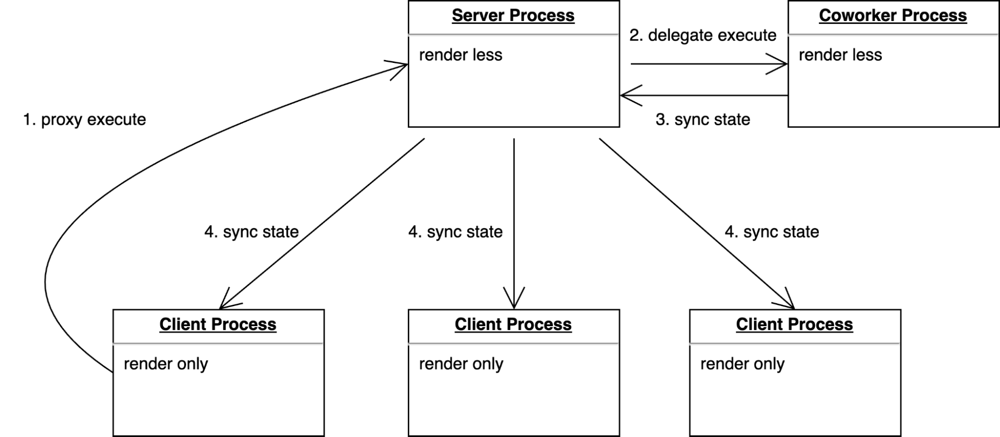

## Motivation

As modern front-end applications become larger, making full use of the device's CPU multi-cores to improve performance may become an important trend.

Front-end applications often run in a single browser window, and JavaScript runs on a single thread. This means that common web applications cannot take full advantage of a CPU's multiple-cores. As applications become larger and more complex, this can lead to performance problems and a poor user experience.

However, there is good news (the gradual phasing out of IE and Safari v16 support for Shared Worker). Modern browsers widely support various types of Workers, including Shared Workers. Shared Workers are a mature technology that allows multiple threads of JavaScript code to share data and communicate with each other. This makes them ideal for building multi-process front-end applications.

Multi-process front-end applications have several benefits. They can better resolve computation-intensive and slow-running JavaScript, which can improve performance and fluidity. They can also increase the number of concurrent requests that can be processed, which can improve the responsiveness of the application.

So we aim to explore a Web application framework that leverages multi-processing.

## Web application with Multi-Processing

In a multi-process web architecture, we can leverage the Shared Web Apps concept of reactant-share to extend general multi-process programming.

Shared Web Apps allows running web applications in multiple browser windows or workers. It uses a unique front-end server (like a Shared Worker) to share web apps, whether it's code sharing, local storage sharing, state sharing, and so on. Regardless of how many browser windows are opened, there's always only one server application instance shared among multiple client applications for the Shared Web Apps. It enables Web Tabs to only perform rendering separation, thus making better use of the device's multi-cores and ensuring smooth operation of the web application.

Shared Web Apps provides the following benefits:

- Reduces the mental burden of multi-process programming by implementing Isomorphism with a universal modular model. Isomorphism is the ability to execute the same code on both the server process, client process or other process, which simplifies multi-process programming.
- Ensures smooth operation of the front-end server process by transferring compute-intensive tasks to another process. This frees up the front-end server process to focus on business logic and the client process to focus on rendering, which improves performance and responsiveness.
- Improves request concurrency by using a better multi-process model. This allows the web application to handle more requests simultaneously.

## Coworker based on reactant-share

Based on reactant-share, we have implemented the Coworker model, which facilitates state sharing across multiple processes, synchronizes state, and minimizes state changes with patches to ensure optimal performance in multi-process execution.



The Coworker model consists of three types of processes:

- Client Process: The rendering process, which accepts shared state and only renders the web UI. It is lightweight to ensure smooth rendering.
- Server Process: The main process, which executes most of the application business logic. It should also ensure smooth running.
- Coworker Process: The process responsible for compute-intensive business or request-intensive logic. This process frees up the server process to focus on business logic. The server process can reduce blocking caused by JavaScript and is less susceptible to the effects of request-intensive logic.

In "Base" mode, Reactant Shared Apps has only two processes: the Tab process and the Coworker process. The Coworker process uses a Web Worker by default.

## Implementation of Coworker

For the related principles of Reactant-Share, please see the following link: https://reactant.js.org/blog/2021/10/03/how-to-make-web-application-support-multiple-browser-windows

Coworker consists of two modules:

- **CoworkerAdapter**: Provides transport for communication between the server process and the coworker process.
- **CoworkerExecutor**: Handles synchronization of shared state between processes and custom Coworker type modules (used for proxy execution of coworkers). Coworkers are synchronously sent to the main process in one direction. Each time a Coworker syncs its state, it carries a sequence tag. If the sequence is abnormal, a complete Coworker state synchronization is triggered automatically to ensure the consistency of the shared state between the Coworker and the main process.

## Core Concepts and Advantages of Coworker

- **Isomorphism**: All processes execute the same code, which enhances the maintainability of multi-process programming in JavaScript.
- **Process Interaction based on the Actor Model**: Relying on the Actor model, this method reduces the cognitive load of multi-process programming in JavaScript.
- **Generic Transport Model**: Coworker supports any transport based on data-transport (https://github.com/unadlib/data-transport), so it can run in any container that supports transport, including SharedWorker. The following is a list of supported transports:
  - iframe
  - Broadcast
  - Web Worker
  - Service Worker
  - Shared Worker
  - Browser Extension
  - Node.js
  - WebRTC
  - Electron
  - Any other port based on data-transport
- **High Performance Based on Mutative**: [Mutative](https://github.com/unadlib/mutative) is faster than the naive handcrafted reducer and 10x faster than Immer. Updates to immutable data based on Mutative also maintain good performance. The patches obtained from the shared state update are used for state synchronization.
- **High Performance**: Due to Coworker taking on a large number of requests and compute-intensive tasks, the main process and rendering process maintain extremely high performance and user experience.
- **Support for Large Applications**: Reactant provides a complete module model design, including dependency injection and class first, as well as various modular design and dynamic module injections.
- **Separation of Service and Rendering View Modules**: Service modules, which are primarily based on business logic, can execute separately from view modules. This not only achieves separation of concerns but also allows the process to have its own containerization.
- **Graceful Degradation**： If the JavaScript host environment does not support SharedWorker, Coworker reverts to a regular SPA. This does not affect the behavior of any current application.

## API

`delegate()` - It will forward execution to the module and specified function proxies in Coworker, inspired by the Actor model.

## Examples

We will create a Counter application with Coworker based on the ‘Base‘ pattern.

1. Firstly, create app.tsx that contains the ProxyCounter module which needs to be executed in Coworker.

Its calling method `delegate(this.proxyCounter, 'increase', [])` is exactly the same as that of general Shared Web Apps. Whether it will be executed with a proxy in Coworker depends on the configuration of createApp.

```tsx
import React from "react";
import {
  ViewModule,
  injectable,
  useConnector,
  action,
  state,
  delegate,
} from "reactant-share";

@injectable({
  name: "ProxyCounter",
})
export class ProxyCounter {
  @state
  count = 0;

  @action
  increase() {
    this.count += 1;
  }
}

@injectable({
  name: "AppView",
})
export class AppView extends ViewModule {
  constructor(public proxyCounter: ProxyCounter) {
    super();
  }

  @state
  count = 0;

  @action
  increase() {
    this.count += 1;
  }

  component(this: AppView) {
    const [count, proxyCount] = useConnector(() => [
      this.count,

      this.proxyCounter.count,
    ]);

    return (
      <>
        <div>{count}</div>
        <button type="button" onClick={() => delegate(this, "increase", [])}>
          +
        </button>
        <p>proxy in coworker</p>
        <div>{proxyCount}</div>
        <button
          type="button"
          onClick={() => delegate(this.proxyCounter, "increase", [])}
        >
          +
        </button>
      </>
    );
  }
}
```

2. Create the main file `index.ts`. Here, we set `ProxyCounter` as a module of Coworker, and set `isCoworker` to `false`.

```tsx
import { render } from 'reactant-web';
import {
  createSharedApp,
  Coworker,
  CoworkerOptions,
  ICoworkerOptions,
} from 'reactant-share';
import { AppView, ProxyCounter } from './app';

createSharedApp({
  modules: [
    Coworker,
    {
      provide: CoworkerOptions,
      useValue: {
        useModules: [ProxyCounter],
        worker: new Worker(new URL('./coworker.ts', import.meta.url)),
        isCoworker: false,
      } as ICoworkerOptions,
    },
  ],
  main: AppView,
  render,
  share: {
    name: 'SharedWorkerApp',
    type: 'Base',
  },
}).then((app) => {
  app.bootstrap(document.getElementById('app'));
  window.app = app;
});
```

3. Create the Coworker file `coworker.ts`. Here, we also set ProxyCounter as a module of Coworker, but set `isCoworker` to `true`.

```tsx
import {
  createSharedApp,
  Coworker,
  CoworkerOptions,
  ICoworkerOptions,
} from 'reactant-share';
import { AppView, ProxyCounter } from './app';

createSharedApp({
  modules: [
    Coworker,
    {
      provide: CoworkerOptions,
      useValue: {
        useModules: [ProxyCounter],
        isCoworker: true,
      } as ICoworkerOptions,
    },
  ],
  main: AppView,
  render: () => {},
  share: {
    name: 'SharedWorkerApp',
    type: 'Base',
  },
}).then((app) => {
  self.app = app;
});
```

So far, we have completed a basic application with a Coworker. Users trigger the `delegate(this.proxyCounter, 'increase', [])` in the main process via the UI. It will be forwarded to the coworker to execute the increase function of proxyCounter, and the shared state will automatically synchronize back to the main process. The rendering update is completed by the `useConnector()` Hook.

## Q&A

**1. What are the challenges of multi-process programming with Coworker based on reactant-share?**

State sharing and synchronization among processes in multi-process programming are relatively complex. Fortunately, Reactant-share ensures robustness through a shared state design with consistency. The dependencies between isomorphic modules of Coworker should also be taken into account. In development, concepts such as Domain-Driven Design should be practiced as much as possible to avoid incorrect module design.

**2. What are the possible use case types for Coworker?**

- **Request Queue** - Coworker is particularly suitable for modules with intensive requests. Running these in Coworker ensures they don't occupy the main process's request queue, allowing other main process requests to execute.
- **Large Task Execution Blocking** - When a computationally intensive task is executed, the application's main process should not be blocked. Such tasks are well suited for asynchronous execution in Coworker.
- **Isolatable Modules** - Coworker can also be used as a sandbox to isolate execution of some modules.

**3. Are there any specific examples to demonstrate that Coworkers can improve application performance?**

In production, we've introduced Coworker into some specific scenarios for modules related to large data volume text matching. It resulted in a substantial performance improvement, even up to 10x more, significantly enhancing the user experience.

Such computationally intensive text matching used to require users to wait more than 1s in the past, with the webpage being completely blocked. However, after using Coworker, the webpage blockage was reduced to less than 100ms (of course, the actual degree of improvement varies with different data sizes).

**4. Is Coworker usable across different browsers, or does it only support within browser tabs? Can Coworker be used across tabs in different domains?**

Coworker is a multi-process model based on reactant-share, and reactant-share is based on data-transport. Therefore, we only need to use WebRTC transport from data-transport in CoworkerAdapter within Coworker to achieve cross-browser support. Additionally, to support usage across tabs in different domains, we can implement the use of Coworker under cross-domain tabs with an approach using iframe + shared worker.

## Conclusion

Front-end development is at a turning point, driven by advances in front-end technology and browser capabilities. Multi-core CPUs and multi-process tools such as Shared Workers and other Workers are now being used to great effect in front-end development. The emergence of Shared Web Apps with Coworker introduces a new multi-process model for front-end applications, which significantly improves application performance, user experience, and code maintainability. For developers, this means more technical choices and challenges, but also more opportunities and potential.

Multi-process programming for front-end applications is likely to become a key solution for improving front-end performance. This would result in a smoother, more efficient, and more responsive user experience.

- reactant-share Document：https://reactant.js.org/docs/shared-app
- reactant-share Repo: https://github.com/unadlib/reactant/tree/master/packages/reactant-share
