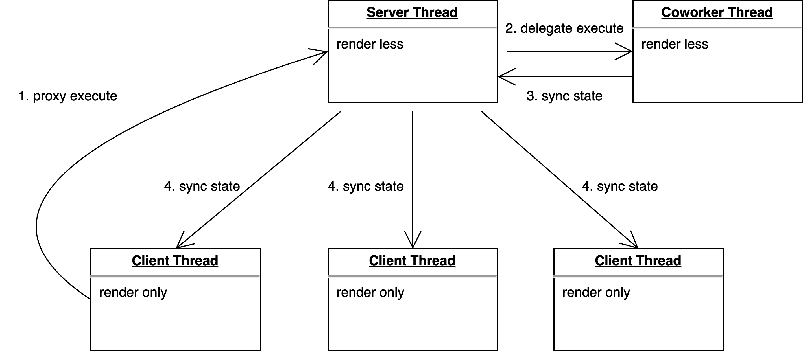

## Motivation

As modern front-end applications become larger, leveraging the device's CPU multi-cores to improve performance is becoming an important trend.

Front-end applications often run in a single browser window, where JavaScript executes on a single thread. This means that common web applications cannot fully utilize a CPU's multiple cores. As applications become larger and more complex, this can lead to performance problems and a poor user experience.

However, there is good news: modern browsers widely support various types of workers, including Shared Workers, as IE and Safari v16 are gradually being phased out (regarding Shared Worker support). Shared Workers are a mature technology allowing multiple threads of JavaScript code to share data and communicate with each other. This makes them ideal for building multithreaded front-end applications.

Multithreaded front-end applications offer several benefits. They can better handle computation-intensive and slow-running JavaScript, which can improve performance and responsiveness. They can also increase the number of concurrent requests that can be processed, which can further improve the application's responsiveness.

Therefore, we aim to explore a web application framework that leverages multithreading.

## Web application with Multithreading

In a multithreaded web architecture, we can leverage the Shared Web Apps concept of reactant-share to expand upon general multithreading programming.

Shared Web Apps allows web applications to run in multiple browser windows or workers. It uses a unique front-end server (such as a Shared Worker) to facilitate sharing across web apps, including code, local storage, state, and more. Regardless of the number of browser windows opened, there is always only one server application instance shared among multiple client applications in Shared Web Apps. This enables web tabs to focus solely on rendering, thereby better utilizing the device's multi-cores and ensuring the smooth operation of the web application.

Shared Web Apps offers the following benefits:

- Reduces the mental burden of multithreading programming by implementing Isomorphism through a universal modular model. Isomorphism refers to the ability to execute the same code on the server thread, client thread, or other threads, simplifying multithreading programming.
- Ensures the smooth operation of the front-end server thread by transferring compute-intensive tasks to another thread. This frees up the front-end server thread to focus on business logic and the client thread on rendering, improving performance and responsiveness.
- Improves request concurrency through a more efficient multithreading model.

## Coworker based on reactant-share

Building upon reactant-share, we have implemented the Coworker model, which facilitates state sharing across multiple threads, synchronizes state, and minimizes state changes using patches to ensure optimal performance in multithreaded execution.



The Coworker model comprises three types of threads:

- client thread: The rendering thread, responsible for accepting shared state and solely rendering the web UI. Its lightweight nature ensures smooth rendering.
- server thread: The main thread, responsible for executing the majority of the application's business logic. Smooth operation is also crucial for this thread.
- Coworker thread: This thread handles compute-intensive business logic or request-intensive logic. This frees the server thread to focus on business logic. This allows the server thread to reduce blocking caused by JavaScript and makes it less susceptible to the impact of request-intensive logic.

In 'Base' mode, Reactant Shared Apps has only two threads: the Tab thread and the Coworker thread. By default, the Coworker thread utilizes a Web Worker.

## Implementation of Coworker

For details on the underlying principles of Reactant-Share, please refer to the following link: https://reactant.js.org/blog/2021/10/03/how-to-make-web-application-support-multiple-browser-windows

Coworker comprises two modules:

- **CoworkerAdapter:** Provides a communication channel between the server thread and the coworker thread.
- **CoworkerExecutor:** Manages the synchronization of shared state between threads and custom Coworker type modules (used for proxy execution of coworkers). Coworker state is synchronously sent to the main thread in one direction. Each time a Coworker synchronizes its state, it includes a sequence tag. If the sequence is out of order, a complete Coworker state synchronization is automatically triggered to ensure the consistency of the shared state between the Coworker and the main thread.

## Core Concepts and Advantages of Coworker

- **Isomorphism:** The ability for all threads to execute the same code enhances the maintainability of multithreading programming in JavaScript.
- **Thread Interaction based on the Actor Model:** By leveraging the Actor model, this approach reduces the cognitive load associated with multithreading programming in JavaScript.
- **Generic Transport Model:** Coworker supports any transport mechanism based on data-transport (https://github.com/unadlib/data-transport), enabling it to run in any container that supports transport, including SharedWorker. The following is a list of supported transports:
  - iframe
  - Broadcast
  - Web Worker
  - Service Worker
  - Shared Worker
  - Browser Extension
  - Node.js
  - WebRTC
  - Electron
  - Any other port based on data-transport
- **High Performance Based on Mutative:** [Mutative](https://github.com/unadlib/mutative) offers high performance, being faster than a naive handcrafted reducer and 10 times faster than Immer. Mutative also maintains good performance when updating immutable data. Patches generated from shared state updates are used for state synchronization.
- **High Performance:** Because Coworker handles a large number of requests and compute-intensive tasks, the main thread and rendering thread can maintain extremely high performance and a superior user experience.
- **Support for Large Applications:** Reactant offers a complete module model design, including dependency injection and a class-first approach, along with various modular design patterns and dynamic module injection capabilities.
- **Separation of Service and Rendering View Modules:** Service modules, primarily focused on business logic, can execute independently from view modules. This not only achieves separation of concerns but also allows each thread to have its own containerization.
- **Graceful Degradation:** If the JavaScript host environment does not support SharedWorker, Coworker gracefully degrades to a regular SPA. This does not affect the behavior of existing applications.

## API

`delegate()` - This function forwards execution to the specified module and function proxies within the Coworker, drawing inspiration from the Actor model.

## Examples

We will create a Counter application using Coworker based on the 'Base' pattern.

1. First, create `app.tsx`, which contains the `ProxyCounter` module that will be executed in the Coworker.

Its calling method, `delegate(this.proxyCounter, 'increase', [])`, is identical to that used in general Shared Web Apps. Whether it is executed with a proxy in the Coworker depends on the configuration of `createApp`.

```tsx
import React from "react";
import {
  ViewModule,
  injectable,
  useConnector,
  action,
  state,
  delegate,
} from "reactant-share";

@injectable({
  name: "ProxyCounter",
})
export class ProxyCounter {
  @state
  count = 0;

  @action
  increase() {
    this.count += 1;
  }
}

@injectable({
  name: "AppView",
})
export class AppView extends ViewModule {
  constructor(public proxyCounter: ProxyCounter) {
    super();
  }

  @state
  count = 0;

  @action
  increase() {
    this.count += 1;
  }

  component(this: AppView) {
    const [count, proxyCount] = useConnector(() => [
      this.count,
      this.proxyCounter.count,
    ]);

    return (
      <>
        <div>{count}</div>
        <button type="button" onClick={() => delegate(this, "increase", [])}>
          +
        </button>
        <p>proxy in coworker</p>
        <div>{proxyCount}</div>
        <button
          type="button"
          onClick={() => delegate(this.proxyCounter, "increase", [])}
        >
          +
        </button>
      </>
    );
  }
}
```

2. Create the main file, `index.ts`. Here, we configure `ProxyCounter` as a module of Coworker and set `isCoworker` to `false`.

```tsx
import { render } from 'reactant-web';
import {
  createSharedApp,
  Coworker,
  CoworkerOptions,
  ICoworkerOptions,
} from 'reactant-share';
import { AppView, ProxyCounter } from './app';

createSharedApp({
  modules: [
    Coworker,
    {
      provide: CoworkerOptions,
      useValue: {
        useModules: [ProxyCounter],
        worker: new Worker(new URL('./coworker.ts', import.meta.url)),
        isCoworker: false,
      } as ICoworkerOptions,
    },
  ],
  main: AppView,
  render,
  share: {
    name: 'SharedWorkerApp',
    type: 'Base',
  },
}).then((app) => {
  app.bootstrap(document.getElementById('app'));
  window.app = app;
});
```

3. Create the Coworker file, `coworker.ts`. Here, we also configure `ProxyCounter` as a module of Coworker, but this time set `isCoworker` to `true`.

```tsx
import {
  createSharedApp,
  Coworker,
  CoworkerOptions,
  ICoworkerOptions,
} from 'reactant-share';
import { AppView, ProxyCounter } from './app';

createSharedApp({
  modules: [
    Coworker,
    {
      provide: CoworkerOptions,
      useValue: {
        useModules: [ProxyCounter],
        isCoworker: true,
      } as ICoworkerOptions,
    },
  ],
  main: AppView,
  render: () => {},
  share: {
    name: 'SharedWorkerApp',
    type: 'Base',
  },
}).then((app) => {
  self.app = app;
});
```

Thus far, we have created a basic application using a Coworker. Users trigger the `delegate(this.proxyCounter, 'increase', [])` function in the main thread via the UI. This action is forwarded to the coworker to execute the `increase` function of `proxyCounter`, and the shared state automatically synchronizes back to the main thread. The rendering update is handled by the `useConnector()` Hook.

## Q&A

**1. What are the challenges of multithreaded programming with Coworker based on reactant-share?**

State sharing and synchronization among threads in multithreaded programming are inherently complex. Fortunately, Reactant-share ensures robustness through a consistent shared state design. The dependencies between isomorphic modules within Coworker should also be considered. During development, adopting concepts like Domain-Driven Design is recommended to prevent improper module design.

**2. What are the potential use cases for Coworker?**

- **Request Queue:** Coworker is particularly well-suited for modules handling a high volume of requests. Running these within Coworker prevents them from occupying the main thread's request queue, allowing other main thread requests to execute unimpeded.
- **Large Task Execution Blocking:** To avoid blocking the application's main thread during the execution of computationally intensive tasks, such tasks are ideal for asynchronous execution within Coworker.
- **Isolatable Modules:** Coworker can also serve as a sandbox to isolate the execution of specific modules.

**3. Are there specific examples demonstrating how Coworker can improve application performance?**

In production, we have implemented Coworker in specific scenarios for modules involving text matching with large data volumes. This resulted in a substantial performance improvement, in some cases up to 10x, significantly enhancing the user experience. Previously, such computationally intensive text matching would require users to wait over 1 second, during which the webpage would be completely blocked. However, after implementing Coworker, the webpage blockage was reduced to less than 100ms (the actual degree of improvement varies depending on data size).

**4. Is Coworker usable across different browsers, or is its support limited to within browser tabs? Can Coworker be used across tabs in different domains?**

Coworker is a multithreaded model built upon reactant-share, which in turn is based on data-transport. Therefore, utilizing the WebRTC transport from data-transport within Coworker's CoworkerAdapter is sufficient to achieve cross-browser support. Additionally, to enable usage across tabs in different domains, we can implement Coworker under cross-domain tabs using an iframe and shared worker approach.

## Conclusion

Front-end development is at a turning point, driven by advancements in front-end technology and browser capabilities. Multi-core CPUs and multithreading tools like Shared Workers and other Workers are now being utilized effectively in front-end development. The emergence of Shared Web Apps with Coworker introduces a novel multithreading model for front-end applications, significantly improving application performance, user experience, and code maintainability. For developers, this signifies more technical choices and challenges, but also greater opportunities and potential.

Multithreaded programming for front-end applications is likely to become a key solution for enhancing front-end performance. This will result in a smoother, more efficient, and more responsive user experience.

- reactant-share Document：https://reactant.js.org/docs/shared-app
- reactant-share Repo: https://github.com/unadlib/reactant/tree/master/packages/reactant-share

